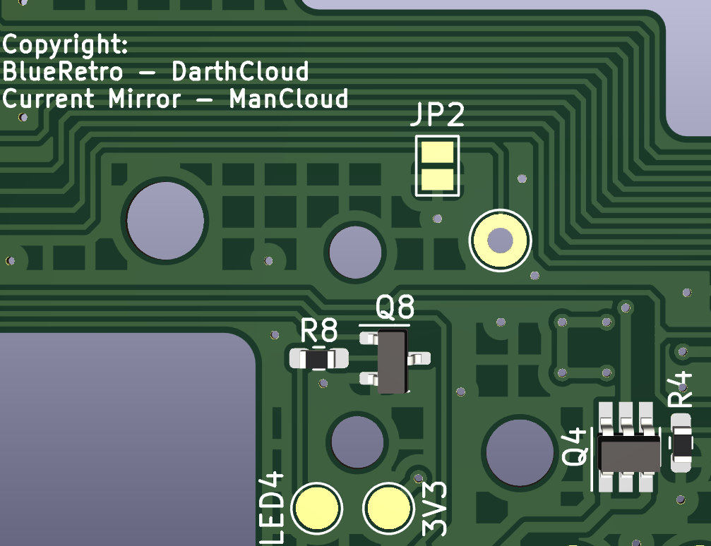

# Internal BlueRetro Flex-PCB for Nintendo 64

### Table of Content

- [Introdution](https://github.com/TharathielCB/BR4N64#introdution)
- [Featureset](https://github.com/TharathielCB/BR4N64#featureset)
- [Usage](https://github.com/TharathielCB/BR4N64#usage-and-description)
- [Building](https://github.com/TharathielCB/BR4N64#building)
- [Installation](https://github.com/TharathielCB/BR4N64#installation)

## Introdution

This is an internal flex PCB based on [Darthclouds BlueRetro](https://github.com/darthcloud/BlueRetro) and on [ManClouds Current Mirror](https://github.com/ManCloud/CurrentTrigger). It is designed as an all-in-one modification containing the whole featureset. The "Usage sction" was moved on top of this document, because most people want to bring back in mind how to use it instead of how to build it.\
***I want to give a very huge shoutout to ManCloud for his great support on this project.***

## Featureset

- **Internal flex-PCB**\
It is soldered direct to the controller ports - no wires needed!
- **Port detection via Current Trigger**\
It detects if a physical controller is connected and disconnect the Bluetooth controller on this Port.
- **Power detection**\
It detects the current power state of the console.
- **Parallel power relays**\
You can turn the console on and off with the controller.
- **Reset Control**\
You can reset the console via the controller and you can change the state of the ESP with the reset button, eg. Pairing mode or resetting the ESP config.
- **Optional power LED control**\
The power LED of the console shows the current status of the ESP eg. Pairing mode.
- **Optional port LEDs output via solder pads**\
You can install LEDs to your controller ports and wire them to the pads to illuminate the ports and see the current controller status (eg. connected, disconnected, pairing)

## Usage and Description
Once the PCB is assembled, flashed and installed you are ready to use the BR4N64! 

### Pairing
In default configuration BlueRetro is always in inquiry mode (LED pulsing) if no controller is connected.\
Pair via inquiry first (SYNC or pairing mode), on subsequent connection you can simply connect (button press or power on button).
You may change this behavior by switching inquiry mode in the web config to manual.\
See also: [BlueRetro Wiki - Pairing](https://github.com/darthcloud/BlueRetro/wiki#3---pairing-bluetooth-controller)

### Webconfig
You can access the webconfig via https://blueretro.io. \
Please familiarize yourself with the following webiste for the usage of the webconfig: [User Manual](https://github.com/darthcloud/BlueRetro/wiki/BlueRetro-BLE-Web-Config-User-Manual)

### Port detection
When conecting someting to the controller port (e.g. Controller, GC2N64, other adapters), the bluetooth connection will be moved from this port to the next unused port. 
The physical connected device has to draw at least 500 uA to be recognized correctly.

### N64 Power switch 
The power switch can be used as usual in addition to powering via the relay (BT connect or reset switch) but turning off the ESP32 requires pulling the power cord.

### N64 Reset button
- **System reset behavior while ESP32 off & system off**\
Holding system reset and then powering system put the ESP32 in boot (download) mode. Effectively disabling it for the current power session.
- **System reset behavior while ESP32 on & system off**\
System is powered on via power relay / power pin
- **System reset behavior while ESP32 on and system on**\
Button press **under 3 sec** (All LEDs solid): Usual system reset.\
Button press **between 3 sec and  6 sec** (All LEDs blink slowly): If in pairing mode: Stop pairing mode otherwise all BT devices are disconnect.\
Button press **between 6 sec and 10 sec** (All LEDs blink fast): Start pairing mode.\
Button press **over 10 sec** (All LEDs blink very fast): Factory reset ESP32 to original BlueRetro firmware the device shipped with & reset configuration.
- **System reset behavior while ESP32 off and system on**\
While the ESP32 is in boot mode or in deep sleep the system reset function is lost.

See also: [BlueRetro Wiki - Reset Button](https://github.com/darthcloud/BlueRetro/wiki/BlueRetro-HW2-Internal-Install-Specification#3---reset-button)

### Port status LEDs
- **Behavior while in pairing mode**\
The first available port LED will be pulsing.
- **Behavior when BT controller connected**\
Port which got an active BT connection will have it's corresponding LED solid.
- **Behavior while system reset is pressed (Boot button)**\
All port LED are used to indicate current switch function (See third point on [N64 Reset button](https://github.com/TharathielCB/BR4N64#n64-reset-button) above)

### Global status LED
- **Behavior while in pairing mode**\
LED will be pulsing.
- **Behavior while system reset is pressed (Boot button)**\
LED indicate current switch function (See third point on [N64 Reset button](https://github.com/TharathielCB/BR4N64#n64-reset-button) above)
- **Behavior when an unrecoverable error occur**\
LED will be solid.

## Building

### Hardware
There are two different versions of this flex PCB. They differs how to solder the ESP. If you want to use an assembly service you should use the "PCBA-Version", but if you want to solder the pcb by yourself you should use the "DIY-Version".\
The DIY-Version has some vias below the ground plate of the ESP to get this properly soldered.\
You can get the Gerber files, the BOM and position files for the assembly as well as the KiCAD files in its designated folders.
- [PCBA](https://github.com/TharathielCB/BR4N64)
- [DIY](https://github.com/TharathielCB/BR4N64)

### Software
You can connect a standard ftdi programmer to the pin header connector right beside the ESP.\
**Disclaimer: Please do not close the jumper JP2 if you are using a standard ftdi programmer!**\
If you want to use a small USB-UART Bridge (eg. a CP2102) only with RX, TX, 3V3 and GND on it, you have to close the jumper JP2 to set the ESP in programming mode.\

The connection order of the pinheader is printed on the backside of the PCB and shown in the picture below:

Once you connected the ESP with your PC correctly you can follow the flashing guide on DarthClouds BlueRetro Github:
- [Windows](https://github.com/darthcloud/BlueRetro/wiki/Flashing-firmware-Windows-10)
- [Linux/macOS](https://github.com/darthcloud/BlueRetro/wiki/BlueRetro-DIY-Build-Instructions#build-instructions)

Please follow also DarthClouds Github Wiki for updating the ESP:
- [How to update the firmware](https://github.com/darthcloud/BlueRetro/wiki#8---updating-firmware)

## Installation

### Preparation of the Nintendo 64

Remove the filter capacitors on the bottom side of the N64 to cut the powerline of the controllers:
- FIL1
- FIL3
- FIL5
- FIL7

Cut the reset trace as shown in the following picture on the top side of the N64.

## Installation of the flex-PCB
Once the PCB is fully assembled and programmed you can place it on the backside of the N64 motherboard. It should perfectly fit with the power pins on the right side, with the controller pins on the lower side and with the reset pin on the left side.\

If everything is well aligned you should start with the powerpins on the right side following by the controller pins on the lower side and finish with the reset pin on the left side. Lastly, solder the reset pin on the extension arm. There is a solder pad at the beginning of this extension arm if you rip it of by accident.\

If you want to use the the lower shield please isolate the contacts of the ESP and the capacitor below on the left side.

Once you finished this you can close the jumper JP1 for the power LED. There is no need of removing its resistor on the N64 motherboard.\

Afterwards you can place one extra LED behind each controller port and wire them to the designated solder pads on the flex-PCB if you want to illuminate the ports aswell.\
That's it!

**Stay Retro!**
