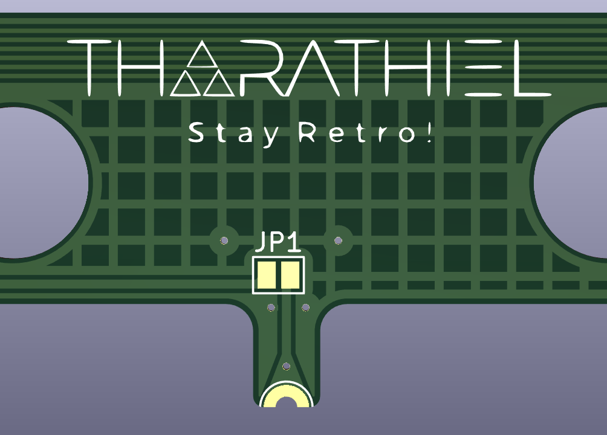

# Internal BlueRetro flex-PCB for Nintendo 64

### Table of Content

- [Featureset](https://github.com/TharathielCB/BR4N64#featureset)
- [Usage](https://github.com/TharathielCB/BR4N64#usage)
- [Building](https://github.com/TharathielCB/BR4N64#building)
- [Installation](https://github.com/TharathielCB/BR4N64#installation)

## Featureset

- **Internal flex-PCB**\
It is soldered direct to the controller ports - no wires needed!
- **Port detection via Current mirror**\
It detects if a physical controller is connected and disconnect the Bluetooth controller on this Port.
- **Power detection**\
It detects the current power state of the console.
- **Parallel power relays**\
You can turn the console on and off with the controller.
- **Reset Control**\
You can reset the console via the controller and you can change the state of the ESP with the reset button, eg. Pairing mode or resetting the ESP config.
- **Optional power LED control**\
The power LED of the console shows the current status of the ESP eg. Pairing mode if you close the jumper on the PCB.
- **Optional port LEDs output via solder pads**\
You can solder LEDs to your controller ports and wire them to the pads to illuminate the ports and see the current controller status (eg. connected, disconnected, pairing)

## Usage

## Building

### Hardware

There are two different versions of this flex PCB. The only difference is how to solder the ESP. If you want to use an assembly service you should use the "Assembly-Version", but if you want to solder the pcb by yourself you should use the "DIY-Version.\
In the DIY-Version are some vias below the ground plate of the ESP to get this properly soldered.\
You can get the Gerber files, the BOM and position files for the assembly as well as the KiCAD files in its designated folders.
- [Assembly-Version](https://github.com/TharathielCB/BR4N64)
- [DIY-Version](https://github.com/TharathielCB/BR4N64)

### Software

**Please do not program the ESP if it is already installed in the N64!**\
You can connect a standard ftdi programmer to the pin header connector right beside the ESP.\
**Please do not close the jumper JP2 if you are using a standard ftdi programmer!**\
You have to close the jumper JP2 to set the ESP in programming mode, if you want to use a USB-UART Bridge (eg. a CP2102) only with RX, TX, 3V3 and GND on it.\
The connection order of the pinheader is shown in the picture below:

Once you connected the ESP with your PC correctly you can follow the flashing guide on DarthClouds BlueRetro Github:*insert link*\
Please read this section to update the firmware. *insert link*

## Installation

### Preraration of the Nintendo 64

Remove the filter capacitors on the bottom side of the N64 to cut the powerline of the controllers:
- FIL1
- FIL3
- FIL5
- FIL7

**If you want to let the ESP control the Power LED you have to remove the Resistor R31 aswell.**

Cut the reset trace as shown in the following picture on the top side of the N64.

## Installation of the flex-PCB
Once the PCB is fully assembled and programmed you can lay it on the N64 motherboard. It should perfectly fit with the power pins on the right side, with the controller pins on the lower side and with the reset pin on the left side.\
*insert installation picture*

If everything is well aligned you should start with the powerpins on the right side following by the controller pins on the lower side and finish with the reset pin on the left side. Lastly, solder the reset pin on the extension arm. There is a solder pad at the beginning of this extension arm if you rip it of by accident.\
Once you finished this you can close the jumper JP1 for the power LED if you have removed its resistor R31 on the N64 motherboard.\
**Please do not close this jumper if you have not removed R31!**

Afterwards you can place one extra LED behind each controller port and wire them to the designated solder pads on the flex-PCB if you want to illuminate the ports aswell.\
This is it!

**Stay Retro!**
